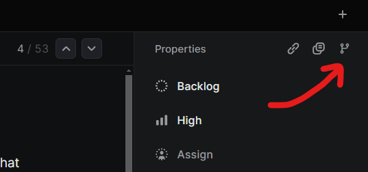

# \[Secret Project\]

This document provides a summary of the publicly available documentation for our **\[secret project\]**.

## Table of Contents

1. [Introduction](#introduction)
2. [Architecture](#architecture)
   - [Non-technical Summary](#non-technical-summary)
   - [List of Tools](#list-of-tools)
3. [Getting Started](#getting-started)
   - [Prerequisites](#prerequisites)
   - [Installation](#installation)
   - [Environment](#environment)
   - [Running the Project](#running-the-project)
4. [Deployment](#deployment)
5. [Project Structure](#project-structure)
6. [Development Workflow](#development-workflow)
7. [Contact](#contact)
8. [License](#license)

## Introduction

`[redacted]`

This `README.md` is a summary of **\[secret project\]** and the home base for all documentation.

## Architecture

### Non-Technical Summary

Read this if you're looking for a high-level discussion of **\[secret project\]**.

#### What are the main parts of the project?

The project is composed of:

- The **Front End**, which takes care of everything the user sees; it's the UI.
- The **Database**, which stores all user/file/etc. data persistently.
- The **Back End**, which acts as the bridge between the database and what the user sees.
- The **Editor**. It's not quite another "section" of the project, but it essentially has its own frontend and backend, so it's thought of separately.

#### What can this project do?

Here are the notable features of the project, described from the perspective of a user interacting with the app and making note of where things might go in the future.

- **Anything Interacts With the Database:** This is a more technical note. Our database is a relational ([what's that?](https://www.ibm.com/topics/relational-databases)) database, so it's based on hard-defined rows and columns. The main implication of this is if we re-design how we store any of our data, we have to deal with complex migrations in production environments, and legacy data might accidentally be lost. It would be bothersome if we had to write all our database requests manually. So, we use an ORM ([what's that?](<https://www.theserverside.com/definition/object-relational-mapping-ORM#:~:text=Object%2Drelational%20mapping%20(ORM)%20is%20a%20way%20to%20align,language%20and%20a%20relational%20database.>)) called [Prisma](https://www.prisma.io/docs/orm) to abstract this behaviour out, which takes the weight off the programmer but mildly decreases the range of queries we can accomplish.

- **User Signs Up:** The user can sign up with email passwordless (we send them a verification email) or with Google Authentication. We use [NextAuth.js](https://next-auth.js.org) for this, but we manage all the errors ourselves. We also have a registration flow where a first-time user inputs data like what industry and size their organization is; this data is stored in a custom format in our own [Vercel-hosted Postgres](https://vercel.com/docs/storage/vercel-postgres) database.

- **User Changes Profile Info:** Once a user logs in, they can navigate to their `profile` edit page. They can currently only modify their name and profile image. The profile image is manually converted to a static white-background `jpeg` image on our server, and uploaded to our public blob ([what's that?](https://learn.microsoft.com/en-us/azure/storage/blobs/storage-blobs-introduction#about-blob-storage)) storage with [Vercel Blob](https://vercel.com/docs/storage/vercel-blob). The code is there to support much more dynamic profile modification, but it's currently not being utilized.

- **View Files in Dashboard:** Users can view their files in their `dashboard` view. This page of course pulls from our database, but it also caches and revalidates ([what's that?](https://nextjs.org/docs/app/building-your-application/data-fetching/caching-and-revalidating)) the data to avoid repeated calls to the database at the slightest breeze, using [Tanstack Query](https://tanstack.com/query/latest/docs/framework/react/overview). The user can rename or delete files, but there currently isn't such a thing as "folders"; there is some database infrastructure to support these, but it's a large undertaking so it should only be tackled if it's important to our clients.

- **Create New Files:** Currently, an entirely separate path `f/new` is how we create new files, since the creation of a file relies on first adding the new file to the database, but then generating a unique URL slug ([what's that?](https://nextjs.org/docs/pages/building-your-application/routing/dynamic-routes)) for that file. This should be revamped at some point but it's more than fine for now.

- `[redacted]`

- `[redacted]`

- `[redacted]`

- `[redacted]`

- `[redacted]`

### List of Tools

#### Admin

- [GitHub](https://github.com/Portage-Labs/) for version control.
- [Linear](https://linear.app/homepage) for project management.
- [Figma](https://www.figma.com) for branding and design.
- [GoDaddy](https://www.godaddy.com) for domain management.

#### Infrastructure

- [Next.js](https://nextjs.org) as the web framework.
- [Tailwind CSS](https://tailwindcss.com/) with [shadcn/ui](https://shadcn.dev) for the interface (New York style).
- [Vercel](https://vercel.com) for hosting.
- [Vercel Postgres](https://vercel.com/docs/storage/vercel-postgres) as the database.
- [Vercel Blob](https://vercel.com/docs/storage/vercel-blob) for blob storage.
- [Prisma](https://www.prisma.io/docs/orm) as the ORM.
- [NextAuth.js](https://next-auth.js.org) for authentication.
- [Resend](https://resend.com/home) for sending emails.
- `[redacted]`
- [Sentry](https://sentry.io/) for error logging and feedback.
- [Tanstack Query](https://tanstack.com/query/latest/docs/framework/react/overview) for query caching.
- [Mutative.js](https://mutative.js.org/) for complex state changes.

## Getting Started

### Prerequisites

Ensure you have the following software installed:

- [Node.js](https://nodejs.org) (version 20 or higher)
- [pnpm](https://pnpm.io/installation)
- [Git](https://git-scm.com)
- [VSCode](https://code.visualstudio.com/Download)

I may have forgotten some things. If so, please add them to the list!

### Installation

1. Clone the repository:

```sh
git clone https://github.com/Portage-Labs/secret-project
```

2. Navigate to the project directory:

```sh
cd secret-project
```

3. Install the dependencies:

```sh
pnpm i
```

### Environment

Your development should be in [VSCode](https://code.visualstudio.com/).

When you open the project folder for the first time, VSCode should prompt you to install the recommended extensions. Do this, as they provide necessary intellisense and support for our dev environment.

You will also need the local environment variables; ask [Josiah](#contact) for those.

<details><summary>Select Helpful VSCode Shortcuts</summary>

- `ctrl + .`: "Quick Fix", usually for finding imports. Put your cursor on the un-imported item.

- `rightclick + Find All References`: I just use this a tonne, it's worth knowing.

</details>

### Running the Project

1. Start the development server:

```sh
just dev
```

2. Open your browser and navigate to `http://localhost:3000`.

## Deployment

**\[secret project\]** is hosted with [Vercel](https://vercel.com). Use the Vercel dashboard to manage the deployments.

## Project Structure

`[redacted]`

## Development Workflow

The following is a guide to the day-to-day git workflow on this project.

Don't forget about the [HOW_TO](HOW_TO.md) document if you get stuck on something that's been done before!

1. Go to the [linear](https://linear.app/secret-project/team/S/all) ticket you're working on, and copy the git branch name.



2. Create new branch off `dev` by that name:

```sh
git checkout -b {name-you-copied} dev
```

3. As you work, commit with [conventional commits](https://www.conventionalcommits.org/en/v1.0.0/). Eg:

```txt
feat(dashboard): Add unpopulated file cards.
```

4. After your first few commits, create a _Draft_ PR (into `dev`) via [GitHub](https://github.com/Portage-Labs/secret-project/pulls) after your first commit. Update the PR title to adhere to [conventional commits](https://www.conventionalcommits.org/en/v1.0.0/)

5. When you're finished your changes, review your PR. This involves going through all your changes' diffs and running the `prep` command. Commit the changes.

```sh
just prep
# ... fix any errors ...
git commit -m "update: Code review"
```

6. Convert the `Draft` PR to `Ready` when you've finished your changes, and request a review.

7. After passing all checks, ensure the title is correct, and merge by squashing.

<details><summary>High-level workflow approach</summary>

You can skim [this slideshow](https://speakerdeck.com/ewoodh2o/release-management-git-workflow?slide=1) for a summary of the steps you should know as a tech lead.

To simplify things for the modern day, augment the above with [this](https://nvie.com/posts/a-successful-git-branching-model/) paradigm.

For each version release, it is probably a good idea to make an [annotated tag](https://git-scm.com/book/en/v2/Git-Basics-Tagging) for that version.

</details>

<details><summary>Release branch workflow</summary>

Releasing is when we merge from `dev` to `main`.

Via CI/CD set up through Vercel and Github Actions, this automatically deploys the code on **\[secret url\]**, so make sure you're ready for the release!

1. Create new branch from `dev`

```sh
git checkout -b release-1.2 dev
```

2. Commit changes of all release-related updates

```sh
git commit -a -m "release(1.2): Bumped version number"
```

3. Tag and merge the release branch

```sh
git checkout main
git merge --no-ff release-1.2
git tag -s -a 1.2
git checkout dev
git merge --no-ff release-1.2
git branch -d release-1.2
```

</details>

## Contact

For development, the best way to contact is via direct messages on Slack.

For other admin information, contact the developers at `dev[at]portagelabs[dot]io`

## License

This project is proprietary and confidential. Unauthorized copying of this project, via any medium, is strictly prohibited.

Copyright © [Secret Project](https://example.com/terms) and [Portage Labs](https://www.portagelabs.io/), 2024
